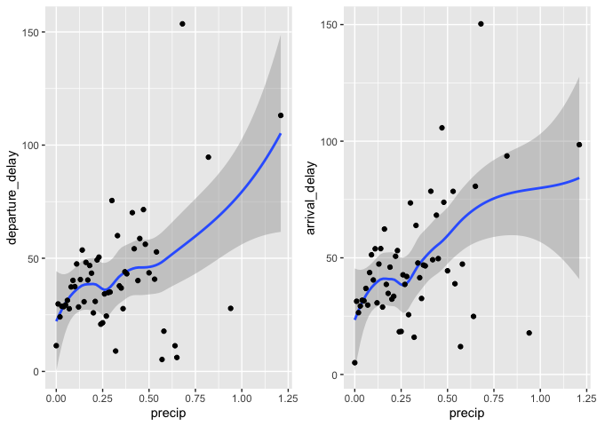

Week 4:Homework 3
================
Erika Park
10/5/2021

**I will first explain the procedures in the beginning, and show the
results in each section.**

### Procedures

1.  Relationship between delays and the age of a plane.

<!-- end list -->

  - Since the question does not specify if the delay means arrival or
    departure delay, I looked at both of them.
  - In order to compare delays and age of planes, the two datasets have
    to be merged: flights and planes.
  - The average and departure delays are calculated for each age of a
    flight.

<!-- end list -->

2.  Relationship between weather conditions and the delay.  

<!-- end list -->

  - Among the weather conditions, I intuitively thought that the
    precipitation would be most related to the delays of flights. Thus,
    I looked at the precipitation from the combined data of flight and
    weather with departure delays.

<!-- end list -->

3.  Looking for the hours that had the worst delays

<!-- end list -->

  - I used departure delay, since I think it is more sensitive to the
    weather conditions.
  - I grouped flights data by hour of scheduled departure time and
    calculated average delay.
  - Then, I arranged the observations to see the highest average delay
  - After that, I treid to get the weather for the most delayed hours
    and plotted the mean of departure hours and the departure time to
    see the relationship.

## 1\. Relationship between delays and the age of a plane.

  - The age of the planes and the departure or arrival of delays do not
    seem to be positively related.
  - From plane age 0 to 10, it seems like the delays increases as the
    planes get more aged. However, as the age of the plane goes beyond
    10 years, it seem to decrease. However, it is hard to say that it
    has a decreasing trend, because the data is scattered.

<!-- end list -->

``` r
combined_data = inner_join(flights,
  select(planes, tailnum, plane_year = year),
  by = "tailnum") %>%
  mutate(age = year - plane_year) %>%  
  group_by(age) %>% 
  summarise(
    dep_delay = mean(dep_delay, na.rm = TRUE),
    arr_delay = mean(arr_delay, na.rm = TRUE),
    arr_delay_num = sum(!is.na(arr_delay)),
    dep_delay_num = sum(!is.na(dep_delay))
  )

## relationship between the age of a plane and its delays 
plot1 = ggplot(combined_data, aes(x = age, y = dep_delay)) +
  geom_point()+ 
  geom_smooth()

plot2 = ggplot(combined_data, aes(x = age, y = arr_delay)) +
  geom_point() + 
  geom_smooth()

grid.arrange(plot1, plot2, ncol = 2)
```

    ## `geom_smooth()` using method = 'loess' and formula 'y ~ x'
    ## `geom_smooth()` using method = 'loess' and formula 'y ~ x'


## 2\. Relationship between weather conditions and the delay.

  - As the precipitation increases, both the departure and arrival
    delays increases as well, as the smoothing line increases as the
    precipitation increases.
  - However, it is hard to say that the departure and arrival delays are
    highly correlated with the precipitation, because there are some
    outstanding outliers; there are a few planes that has lower mean
    delays despite the increasing precipitation.

``` r
# weather conditions and delay 
weather = flights %>%
  inner_join(weather, by = c(
    "origin" = "origin","year" = "year","month" = "month",
    "day" = "day","hour" = "hour"
  ))

plot1 = weather %>%
  group_by(precip) %>%
  summarise(departure_delay = mean(dep_delay, na.rm = TRUE)) %>%
  ggplot(aes(x = precip, y = departure_delay)) +
  geom_smooth() + 
  geom_point() #+ geom_line()

plot2 = weather %>%
  group_by(precip) %>%
  summarise(arrival_delay = mean(arr_delay, na.rm = TRUE)) %>%
  ggplot(aes(x = precip, y = arrival_delay)) +
  geom_smooth() + geom_point()

grid.arrange(plot1, plot2, ncol = 2)
```

    ## `geom_smooth()` using method = 'loess' and formula 'y ~ x'
    ## `geom_smooth()` using method = 'loess' and formula 'y ~ x'



## 3\. Looking for the hours that had the worst delays

  - It seems like the delays of the flights increases as there are more
    planes that departs. As there are fewer flights in a certain period
    of time, there are less delayed flights. It makes sense by looking
    at the plot where departure time is around at 500, which indicates
    5am in the morning. Before and after 5am, there are fewest flights
    in the air and they are least delayed.

<!-- end list -->

``` r
most_delays = flights %>%
  mutate(hour = sched_dep_time %/% 100) %>%
  group_by(origin, year, month, day, hour) %>%
  summarise(dep_delay = mean(dep_delay, na.rm = TRUE))  %>%
  ungroup() %>%
  arrange(desc(dep_delay)) 
```

    ## `summarise()` has grouped output by 'origin', 'year', 'month', 'day'. You can override using the `.groups` argument.

``` r
weather_most_delayed <- semi_join(weather, most_delays, 
                                  by = c("origin", "year",
                                         "month", "day", "hour"))

ggplot(weather_most_delayed, aes(x = dep_time, y = dep_delay)) + geom_point() + geom_smooth()
```

    ## `geom_smooth()` using method = 'gam' and formula 'y ~ s(x, bs = "cs")'


